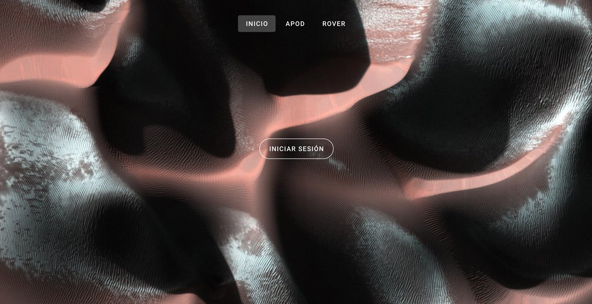

# NASA-Api




### Pre-requisitos:

- Vue, Vuex y Vue Router.

* Firebase Auth.

* CSS Framework - Vuetify.

## Project setup

```
npm install
```

### Compiles and hot-reloads for development

```
npm run serve
```

### Compiles and minifies for production

```
npm run build
```

### Customize configuration

See [web](https://api-nasa-10788.web.app/).

email: mxxx@gmail.com

password: nasagalaxy765
